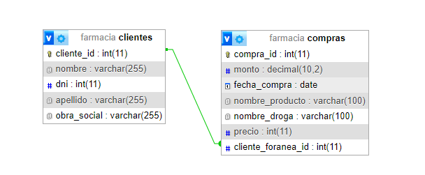

# TPE WEB II Parte 3
## Integrantes: Martín Larrosa, Agustín Pietrobono.
### Base de datos relacionada a una farmacia la cual mediante clientes realizan compras de sus productos. (Medicamentos)

### API requests
- http://localhost/farmacia/api/compras (GET) Para obtener toda la lista de las compras.
- http://localhost/farmacia/api/compras/id (GET) Para obtener una compra.
- http://localhost/farmacia/api/compras (POST, agregar datos como formato JSON en el body) Para agregar una compra.
- http://localhost/farmacia/api/compras/id (PUT, agregar datos como formato JSON en el body) Para actualizar una compra.
- http://localhost/farmacia/api/compras?orderBy=campo (GET) Ordenar un campo.
- http://localhost/farmacia/api/compras?orderBy=campo&orderDirection=asc (GET) Ordenar por campo ascendente.
- http://localhost/farmacia/api/compras?orderBy=campo&orderDirection=desc (GET) Ordenar por campo descendente.

### Ejemplos
- http://localhost/farmacia/api/compras?orderBy=fecha
- http://localhost/farmacia/api/compras?orderBy=precio&orderDirection=desc

# DER

